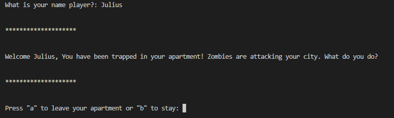
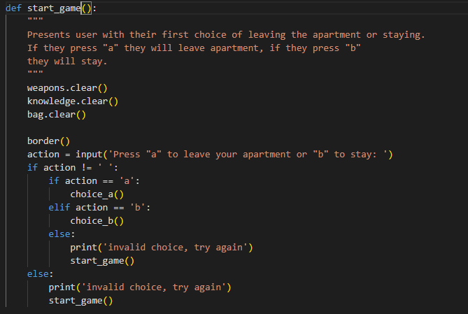
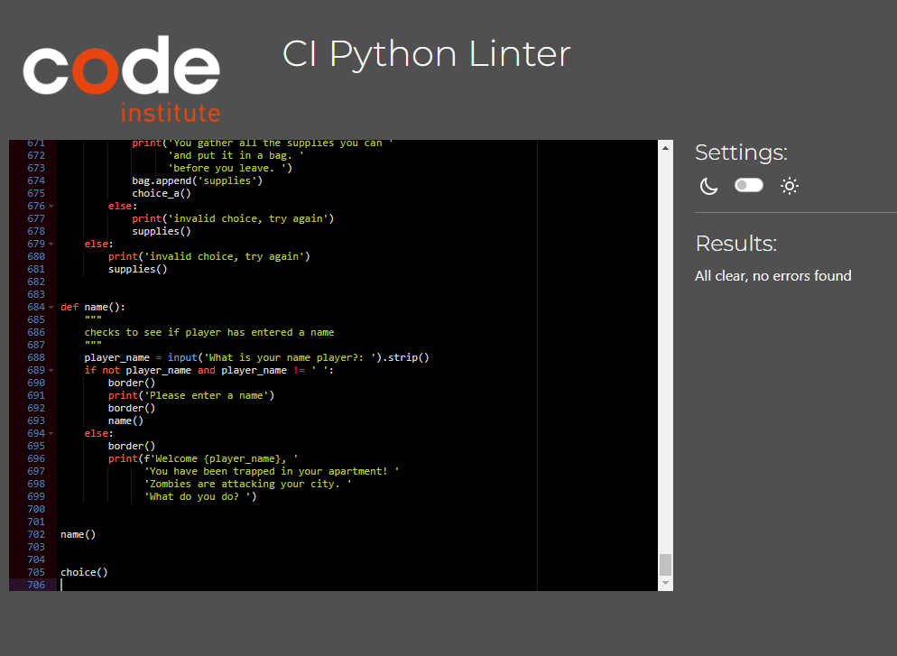

# Survival
Survival is a Python terminal game, which runs in the Code Institute mock terminal on Heroku
[Click here to play!](https://survival.herokuapp.com/)

# How to play

Survival is based on old-school rpg games. Where your choices matter and will affect your character's fate!
It is simple to play and easy to get hooked on. 

All you have to do is follow the instructions and make a choice.

You will be given choices in the form of "Press 'a' if you wish to take the elevator or 'b' if you will take the stairs".

Depending on your previous and future choices you will either meet a grim end or survive long enough to be a hero!

# Features
- Story-based game with multiple endings depending on which choices the player has made.
- Accepts user input
  -
- Saves temporarily the choices the user has made and resets each new game.
- Input validation
  - You cannot enter anything other than the shown letters
  - No empty spaces or just pressing enter
  -

## Future Features
- I would like to add a high score for each player. I was thinking of implementing a point system for each choice you make and then adding it all up together with the name given.

# Data Model
I decided to create a text-based adventure/horror game in Python.

The choices the player makes are temporarily saved until the end of the game. 

I am using variables and lists to store the information, such as the player's name, weapons, supplies and knowledge. Each new iteration resets the game completely. 

There are several different endings. I am using the print method to guide the player and create the atmosphere and conditional statements to make the choices.

# Testing
- I have tested each scenario in my terminal
- I have played it a couple of times on Heroku
- I have also given an error if the player presses another button than the one intended

## Bugs
### Solved Bugs
- Had some issues with linking the choices between gathering water and supplies and the use of the tv and phone.
I created some variables and additional functions at the top to combat this. I also had to make several adjustments to the code, in general, to make it work. Have tested each scenario and I cannot find any bugs.

### Remaining Bugs
- No bugs remaining as far as I am aware

### Validator Testing
- [PEP8 Python Validator](https://pep8ci.herokuapp.com/) 

# Deployment
Steps for deployment:
- Fork or clone this repository
- Create an account on Heroku
- Click on "Create new app" and choose the app name and which region you live in
- Go to the "Settings" tab and scroll down to "Add buildpack"
- Choose Python and Node.js in that order. Python must be above Node.js for Code Institutes template to work.
- Now go to the "Deploy" tab and choose to connect to GitHub and confirm it.
- Search for the repository name and click search. Then click on connect.
- Once done scroll down and click on "Deploy Branch"
- Once it is done a button will become visible called "View"

# Credits
- Code Institute for the deployment terminal
- Code Institute education platform
- [Stackoverflow](https://stackoverflow.com/questions/6190776/what-is-the-best-way-to-exit-a-function-which-has-no-return-value-in-python-be) for learning how to use sys.exit()
